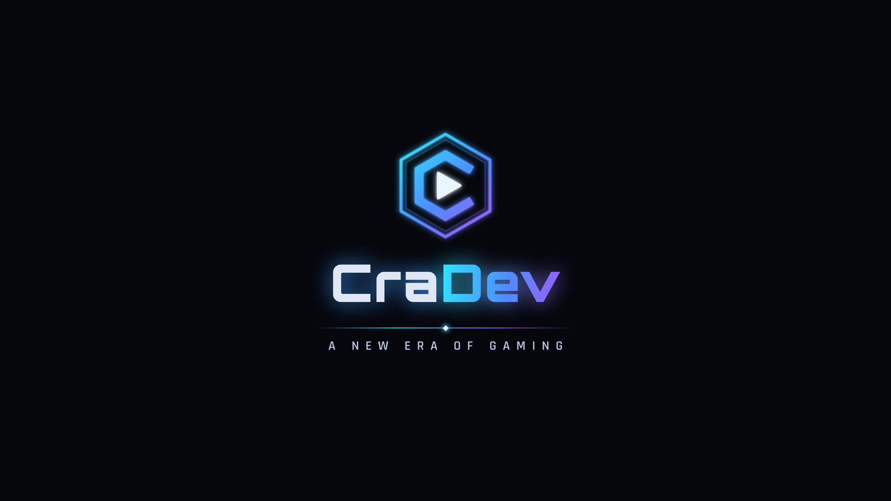

# CraDev — o'yin loyihasi

Unity'da kompyuter uchun (Steam) yaratilayotgan 3D o'yin. O'yinni bosqichma-bosqich quryapmiz.

**Hozirgi bosqich — 1: kompaniya intro'si.** O'yin ochilganda CraDev logosi va
"A NEW ERA OF GAMING" yozuvi animatsiya va ovoz bilan chiqadi.



## Loyihani ochish

1. Loyihani kompyuterga yuklab oling:
   - GitHub Desktop yoki `git clone https://github.com/aiziyrak-coder/oyin-.git`, so'ng
     `claude/gallant-dijkstra-r0opib` branch'iga o'ting;
   - yoki GitHub'da shu branch'ni tanlab, **Code → Download ZIP**.
2. **Unity Hub → Projects → Add → Add project from disk** va loyiha papkasini tanlang
   (ichida `Assets` va `ProjectSettings` papkalari bor papka).
3. Agar Hub "Editor version not installed" desa, ro'yxatdan kompyuteringizdagi
   Unity 6 versiyasini tanlang va versiya almashtirishni tasdiqlang.
4. Birinchi ochilish bir necha daqiqa davom etadi, chunki Unity `Library` papkasini yaratadi.
5. Yuqori menyudan **CraDev → Intro sahnasini yaratish** ni bosing. Sahna
   `Assets/CraDev/Scenes/Intro.unity` ga saqlanadi va Build Settings'da birinchi o'ringa qo'yiladi.
6. **Play ▶** tugmasini bosing. Game oynasida 16:9 yoki 1920x1080 o'lchamini tanlang.

## Unity splash ekranini o'chirish

O'yin boshida "Made with Unity" chiqmasdan, darhol CraDev intro'si ko'rinishi uchun:
**Edit → Project Settings → Player → Splash Image → Show Splash Screen** belgisini olib tashlang.
Unity 6'da buni bepul (Personal) litsenziyada ham qilish mumkin.

## Intro qanday ishlaydi

| Vaqt (s) | Nima bo'ladi |
|---|---|
| 0.0 – 0.8 | Qora ekrandan qorong'i fon ochiladi |
| 0.55 – 1.05 | Emblema paydo bo'ladi, 1.05 da ovozdagi zarba bilan nur chaqnaydi |
| 0.8 – 2.0 | Fonda uchqunlar paydo bo'ladi |
| 1.45 – 2.45 | "CraDev" yozuvi markazdan ikki tomonga ochiladi |
| 2.45 – 3.25 | Yozuv ustidan nur o'tadi (ovozda jiringlash) |
| 2.75 – 3.85 | Ajratuvchi chiziq va "A NEW ERA OF GAMING" |
| 5.6 – 6.6 | Qorong'ilashish, so'ng keyingi sahna (`MainMenu`) |

- Istalgan tugma, sichqoncha yoki geympad tugmasi intro'ni o'tkazib yuboradi.
- Hamma vaqt va effekt qiymatlarini sahnadagi **IntroDirector** obyektining Inspector'idan
  o'zgartirish mumkin ("Vaqtlar" va "Ko'rinish" bo'limlari).
- Intro to'liq UI (Canvas, Screen Space - Overlay) orqali chiziladi, shuning uchun
  Built-in, URP va HDRP render pipeline'larining barchasida bir xil ishlaydi.
- Eski Input Manager ham, yangi Input System ham qo'llab-quvvatlanadi.
- `MainMenu` sahnasi hali yo'q. Intro tugagach ekran qora qoladi va Console'da xabar chiqadi.
  Menyu keyingi bosqichda qo'shiladi.

## Fayllar tuzilmasi

```
Assets/CraDev/
  Intro/Art/        logo qatlamlari (PNG, 4K uchun 2x o'lchamda)
  Intro/Audio/      intro ovozi (WAV)
  Intro/Scripts/    IntroSequence.cs (animatsiya), IntroParticles.cs (uchqunlar)
  Intro/Editor/     IntroSceneBuilder.cs (sahna quruvchi menyu), IntroArtImporter.cs
  Scenes/           Intro.unity (menyu orqali yaratiladi)
Design/Logo/        logo manbalari: compose.html, shriftlar, qayta yaratish skriptlari
```

## Logoni o'zgartirish

Logo `Design/Logo/compose.html` da (HTML/SVG) chizilgan. O'zgartirgandan keyin
`Design/Logo/build.sh` ni ishga tushiring. U barcha PNG qatlamlarni va ovozni qayta
yaratadi (Node.js + playwright, Python 3 + numpy + pillow kerak). O'lchamlar o'zgargan
bo'lsa, Unity'da **CraDev → Intro sahnasini yaratish** ni qayta bosing.

Shriftlar: Orbitron va Rajdhani, ikkalasi ham SIL Open Font License asosida
(`Design/Logo/fonts/OFL-*.txt`), o'yinda bepul ishlatish mumkin.
