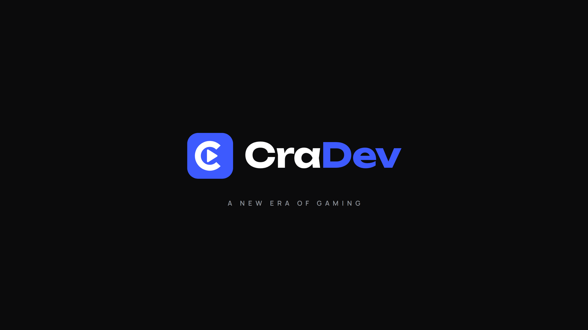
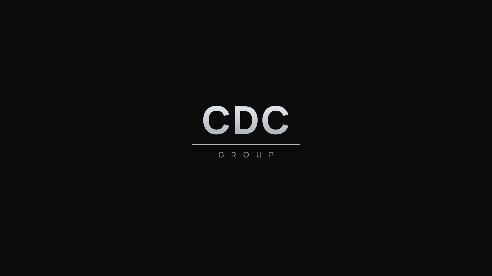

# CraDev — o'yin loyihasi

Unity'da kompyuter uchun (Steam) yaratilayotgan 3D o'yin. O'yinni bosqichma-bosqich quryapmiz.

**Hozirgi bosqich — 3: avatar yaratish.** O'yin ochilganda ketma-ket:

1. **CraDev intro**: kompaniya logosi va "A NEW ERA OF GAMING" yozuvi.
2. **CDCGroup**: ikkinchi brendning kumush logosi.
3. **Loading**: keyingi sahnani fonda yuklaydigan ekran (katta foiz raqami va ingichka chiziq).
4. **Avatar yaratish** (faqat birinchi kirishda): chapda nickname va o'yinchi jinsidagi 5 ta realistik avatar,
   o'ngda tanlangan avatar katta ko'rinishda. Jins pasportdan olinadi, o'yinchi uni tanlamaydi.
   Nickname server'da noyob bo'lishi shart (multiplayer o'yin).

Uslub zamonaviy va minimal: bir xil qora fon, tekis ranglar, aniq shriftlar (Unbounded, Manrope),
qisqa va silliq harakatlar. Uchqun, nur yoki "kosmik" effektlar yo'q.

| CraDev | CDCGroup |
|---|---|
|  |  |

## Loyihani ochish

1. Loyihani kompyuterga yuklab oling:
   - GitHub Desktop yoki `git clone https://github.com/aiziyrak-coder/oyin-.git`, so'ng
     `claude/gallant-dijkstra-r0opib` branch'iga o'ting;
   - yoki GitHub'da shu branch'ni tanlab, **Code → Download ZIP**.
2. **Unity Hub → Projects → Add → Add project from disk** va loyiha papkasini tanlang
   (ichida `Assets` va `ProjectSettings` papkalari bor papka).
3. Agar Hub "Editor version not installed" desa, ro'yxatdan kompyuteringizdagi
   Unity 6 versiyasini tanlang va versiya almashtirishni tasdiqlang.
4. Birinchi ochilish bir necha daqiqa davom etadi, chunki Unity `Library` papkasini yaratadi.
5. Yuqori menyudan **CraDev → Sahnalarni yaratish** ni bosing. Barcha sahnalar
   `Assets/CraDev/Scenes/` ga saqlanadi va Build Settings'da shu tartibda birinchi o'rinlarga
   qo'yiladi. Keyin Intro sahnasi ochiladi.
6. Avatar yaratish ekrani ishlashi uchun serverni ishga tushiring (quyidagi "Server" bo'limi).
7. Tezkor tekshirish uchun **Play ▶** tugmasini bosing (Game oynasida 16:9 yoki 1920x1080 ni tanlang).
8. Haqiqiy o'yindek alohida oynada ko'rish uchun **CraDev → O'yinni alohida oynada ishga tushirish
   (Build and Run)** ni bosing. O'yin `Builds/` papkasiga yig'iladi va to'liq ekranda ochiladi:
   ekranda faqat CraDev intro, CDCGroup va Loading chiqadi. Yopish: Alt+F4.

Loyihani avval ochgan bo'lsangiz ham, yangilangandan keyin shu menyuni bir marta bosing:
u sahnalarni yangi skriptlar bilan qayta yaratadi.

## Server (nickname tekshiruvi)

`Server/` papkasida kichik o'yin serveri bor: o'yinchi profillarini saqlaydi va har bir nickname
faqat bitta o'yinchida bo'lishini ta'minlaydi. Node.js'da yozilgan, tashqi paketlari yo'q,
ma'lumotlar SQLite bazasida (`Server/data/cradev.db`).

1. [Node.js](https://nodejs.org) 22.13 yoki yangiroq versiyasini o'rnating (LTS versiyasi tavsiya etiladi).
2. Terminalda: `cd Server` va `npm start`. Server `http://localhost:8080` da ishga tushadi.
3. Testlar: `npm test`.

Qoidalar (server va o'yinda bir xil):

- 3–16 belgi: lotin harflari, raqamlar va `_`; harf bilan boshlanadi.
- Katta-kichik harf farq qilmaydi: `Ali` band bo'lsa, `ali` ham band.
- `admin`, `moderator`, `cradev` kabi nomlar band qilingan.
- Ikki o'yinchi bir vaqtda bitta nomni olmoqchi bo'lsa, faqat bittasi oladi (bazadagi UNIQUE cheklov).

API:

| So'rov | Javob |
|---|---|
| `GET /api/nicknames/availability?name=Ali` | `{ "available": true }` yoki `{ "available": false, "reason": "taken" }` |
| `POST /api/players` `{ "nickname": "Ali", "gender": "male", "avatarId": "M3" }` | `201` profil va maxfiy `token`; `409` nickname band; `400` avatar jinsga mos emas |

O'yin server manzilini `CharacterCreation` sahnasidagi **CharacterCreationDirector → Server Url**
maydonidan oladi (hozir `http://localhost:8080`). Onlayn o'ynash uchun server keyinchalik VPS'ga
joylanadi va HTTPS orqali ishlaydi.

Profil yaratilgach, u shu kompyuterda saqlanadi va keyingi safar avatar yaratish ekrani chiqmaydi.
Uni qayta ko'rish uchun: **CraDev → Test: saqlangan profilni o'chirish**.

## O'yin oynasi sozlamalari

Menyudagi buyruqlar Player sozlamalarini avtomatik o'rnatadi:

- **"Made with Unity" ekrani o'chiriladi**: o'yin darhol CraDev intro'si bilan boshlanadi.
  Unity 6'da bu bepul (Personal) litsenziyada ham ishlaydi.
- **To'liq ekranli oyna** (Fullscreen Window), monitorning o'z o'lchamida.
- Kompaniya nomi "CraDev". O'yin nomi tanlanguncha oyna sarlavhasi ham "CraDev" bo'ladi.

## Sahnalar qanday ishlaydi

### 1. CraDev intro (4.2 s)

| Vaqt (s) | Nima bo'ladi |
|---|---|
| 0.25 – 0.85 | Ko'k belgi ekran markazida paydo bo'ladi, ichidagi oq shakl biroz keyin chiqadi ("pop" ovozi) |
| 0.95 – 1.80 | Belgi chapga suriladi, uning ortidan "CraDev" yozuvi chiqib keladi (yengil "vish" va akkord) |
| 1.75 – 2.45 | Ostida "A NEW ERA OF GAMING" paydo bo'ladi |
| 3.6 – 4.2 | Qorong'ilashish, so'ng CDCGroup |

### 2. CDCGroup (3.5 s)

| Vaqt (s) | Nima bo'ladi |
|---|---|
| 0.2 – 0.9 | Ingichka kumush chiziq markazdan ikki tomonga cho'ziladi |
| 0.5 – 1.25 | "CDC" chiziq ortidan yuqoriga ko'tariladi (yumshoq past ton) |
| 0.65 – 1.40 | "GROUP" chiziq ortidan pastga tushadi |
| 2.9 – 3.5 | Qorong'ilashish, so'ng Loading |

### 3. Loading

- Keyingi sahnani (`MainMenu`) fonda yuklaydi va foizni katta raqam hamda ingichka chiziq bilan ko'rsatadi. Yuklash juda tez tugasa ham
  ekran kamida 3 soniya ko'rinib turadi. 100% ga yetgach qorong'ilashib, sahna ochiladi.
- `MainMenu` hali yo'q, shuning uchun hozircha jarayon namoyish uchun to'ladi va "READY" bo'lib
  to'xtaydi. Console'da shu haqda xabar chiqadi. Menyu keyingi bosqichda qo'shiladi.
- Keyinchalik istalgan sahnani Loading orqali ochish mumkin: `SceneLoader.Load("Level01");`

### 4. Avatar yaratish

- **Chap tomon:** pasportdan olingan jins (faqat ko'rsatiladi), nickname maydoni va uning holati (tekshirilmoqda, bo'sh,
  band, noto'g'ri), shu jinsdagi 5 ta avatar kartasi va **Create character** tugmasi. Tugma nickname server'da bo'sh
  bo'lgandagina yonadi. Enter ham ishlaydi.
- **O'ng tomon:** tanlangan qahramon katta ko'rinishda. Sichqoncha bilan chapga-o'ngga tortilsa 360° aylanadi,
  qo'yib yuborilgach eng yaqin tomonga silliq to'xtaydi. **Front / Side / Back** tugmalari ham bor. Tepasida
  yozilayotgan nickname ko'rinadi (o'yindagi nom yorlig'i kabi).
- Hozircha avatarlar realistik rasmlar. 3D modellar tayyor bo'lgach, o'ng tomondagi rasm 3D ko'rinishga almashtiriladi.
- Pasport bosqichi hali qurilmagan. Sinov uchun jins **CharacterCreationDirector → Test Gender** maydonidan olinadi.

### Umumiy

- Splash ekranlarini istalgan tugma, sichqoncha yoki geympad tugmasi o'tkazib yuboradi. Loading o'tkazib yuborilmaydi.
- Barcha vaqt va effekt qiymatlarini sahnadagi **IntroDirector**, **CDCGroupDirector** va
  **LoadingDirector** obyektlarining Inspector'idan o'zgartirish mumkin.
- Sahnalar to'liq UI (Canvas, Screen Space - Overlay) orqali chiziladi, shuning uchun
  Built-in, URP va HDRP render pipeline'larining barchasida bir xil ishlaydi.
- Eski Input Manager ham, yangi Input System ham qo'llab-quvvatlanadi.

## Realistik avatarlar (tayyorlanmoqda)

Maneken o'rniga o'ta realistik 3D avatarlar bo'ladi: 5 erkak va 5 ayol, yuzsiz. O'yinchi ro'yxatdan
o'tishda pasport ma'lumotini yuklaydi, jins shundan avtomatik olinadi. Keyin o'z jinsidagi 5 ta avatardan
birini tanlaydi va yuzini skaner qiladi; yuz tanlangan avatarga qo'yiladi.

Reference rasmlar tayyor: `Design/Characters/references/` (3 tomondan ko'rinish, yuzsiz). Hozircha 9 ta,
**M4 (Tall)** rasmi hali yo'q. `Design/Characters/` da yana: avatar tavsiflari (`avatars.json`), rasm promptlari
(`prompts.md`), 3D model talablari (`avatars.html`).

O'yin uchun rasmlar `process_references.py` bilan tayyorlanadi: fon olib tashlanadi va har bir ko'rinish
(old, yon, orqa) `Assets/CraDev/Avatars/Photos/` ga alohida saqlanadi. Aylanishni silliqroq qilish uchun har bir
avatarga 45° burchakli rasmlar ham qo'shish mumkin (`prompts_quarter.md`, fayl nomi `references/<ID>_quarter.png`).
Yangi rasm qo'shish:
`references/M4.png` ni qo'ying, `python3 process_references.py M4` ni ishga tushiring va Unity'da
**CraDev → Sahnalarni yaratish** ni bosing.

## Fayllar tuzilmasi

```
Assets/CraDev/
  Common/Scripts/   SplashSequence.cs (splash asosi), SceneLoader.cs, Anim.cs
  Common/Fonts/     Manrope (Loading yozuvlari uchun)
  Intro/            CraDev intro: Art, Audio, Scripts/IntroSequence.cs
  CDCGroup/         CDCGroup splash: Art, Audio, Scripts/CdcGroupSplash.cs
  Loading/          Loading ekrani: Scripts/LoadingScreen.cs
  CharacterCreation/  avatar yaratish: CharacterCreationScreen.cs, AvatarViewer.cs, AvatarCard.cs
  Avatars/Photos/   avatarlarning fonsiz rasmlari (old, yon, orqa)
  Online/           server bilan ishlash: GameApi.cs, NicknameRules.cs, PlayerProfile.cs, RegistrationSession.cs
  UI/Art/           ikonkalar va 9-slice spritelar
  Editor/           CraDevSceneBuilder.cs (sahna quruvchi menyu), UiBuild.cs, CraDevArtImporter.cs
  Scenes/           Intro, CDCGroup, Loading (menyu orqali yaratiladi)
Server/             o'yin serveri (Node.js): nickname'lar va o'yinchi profillari
Design/
  CraDev/, CDCGroup/             logo manbalari va qayta yaratish skriptlari (build.sh)
  UI/                            ikonkalar (icons.html) va UI spritelar
  Characters/                    avatar tavsiflari, promptlar, reference rasmlar, 3D model talablari
  fonts/                         shriftlar va litsenziyalari
  tools/                         umumiy yordamchi skriptlar
```

## Logolarni o'zgartirish

Logolar `Design/CraDev/compose.html` va `Design/CDCGroup/compose.html` da (HTML/SVG) chizilgan.
O'zgartirgandan keyin shu papkadagi `build.sh` ni ishga tushiring. U PNG qatlamlarni va ovozni
qayta yaratadi (Node.js + playwright, Python 3 + numpy + pillow kerak). Keyin Unity'da
**CraDev → Sahnalarni yaratish** ni qayta bosing.

Shriftlar: Unbounded va Manrope, ikkalasi ham SIL Open Font License asosida
(`Design/fonts/OFL-*.txt`), o'yinda bepul ishlatish mumkin.
